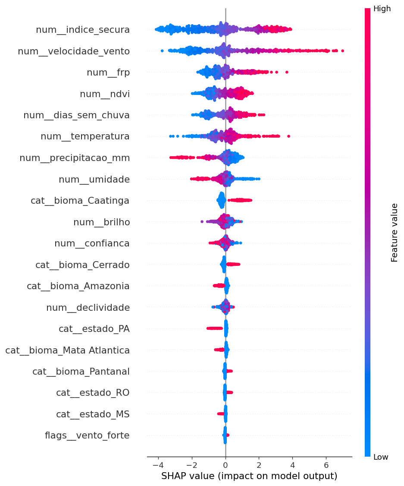
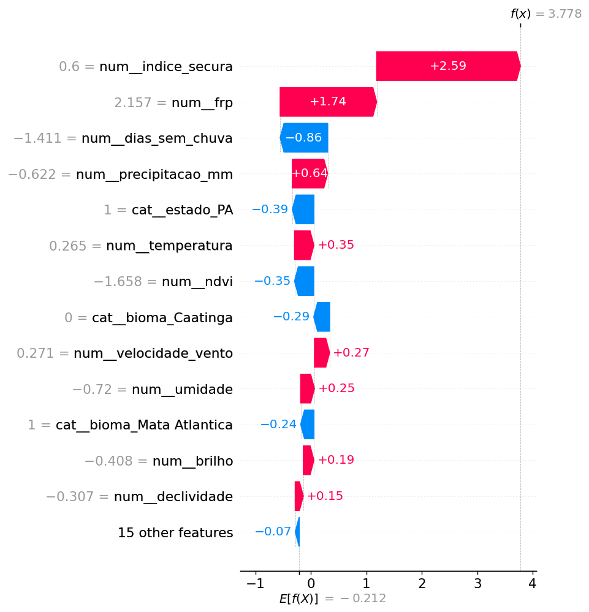
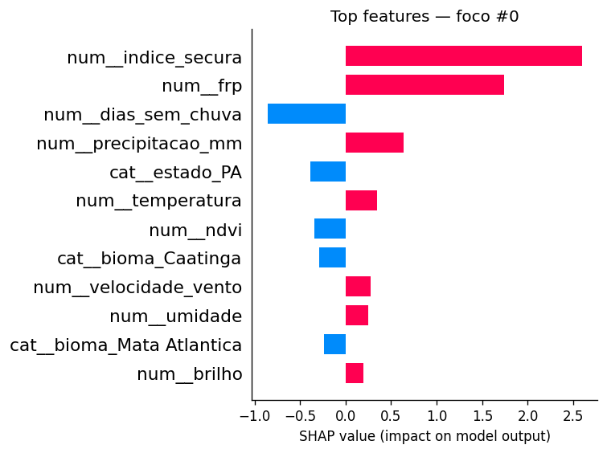

# 🛰️ PIRO — Camada de Aprendizado de Máquina Preditivo

> **Plataforma Integrada de Resposta Orbital**
> Componente de previsão de risco de propagação de queimadas em 24 horas
> Entrega da disciplina **Generative AI For Engineering (GAIE)**

---

**Global Solution 2026 · 1º Semestre · FIAP**
**Engenharia de Software · 4º Ano · ESPW · Presencial**
**Tema:** Indústria Espacial — O Código que Move o Universo

---

## 👥 Integrantes

| Nome completo | RM |
|---------------|-----|
| Júlia Marques | 98680 |
| Matheus Gusmão | 550826 |
| Guilherme Morais | 551981 |

---

## 📑 Sumário

1. [Visão geral](#1-visão-geral)
2. [Conexão com a Indústria Espacial](#2-conexão-com-a-indústria-espacial)
3. [Dataset](#3-dataset)
4. [Pré-processamento e engenharia de atributos](#4-pré-processamento-e-engenharia-de-atributos)
5. [Modelos comparados](#5-modelos-comparados)
6. [Treinamento](#6-treinamento)
7. [Resultados e comparação](#7-resultados-e-comparação)
8. [Interpretabilidade com SHAP](#8-interpretabilidade-com-shap)
9. [Modelo escolhido e justificativa](#9-modelo-escolhido-e-justificativa)
10. [Demonstração funcional](#10-demonstração-funcional)
11. [Como executar](#11-como-executar)
12. [Estrutura do repositório](#12-estrutura-do-repositório)
13. [Limitações e trabalhos futuros](#13-limitações-e-trabalhos-futuros)
14. [Vídeo de apresentação](#14-vídeo-de-apresentação)
15. [Tecnologias](#15-tecnologias)
16. [Referências](#16-referências)

---

## 1. Visão geral

Este repositório contém a entrega da disciplina **Generative AI For Engineering (GAIE)** do projeto **PIRO — Plataforma Integrada de Resposta Orbital**, desenvolvido para a Global Solution 2026 da FIAP sob o tema Indústria Espacial.

O PIRO é um sistema integrado que ingere dados orbitais em tempo quase-real, classifica imagens satelitais por rede neural convolucional, **prevê o risco de propagação de cada foco por aprendizado de máquina** e aciona automaticamente brigadistas e órgãos ambientais via automação RPA. Esta entrega corresponde especificamente à **camada de Aprendizado de Máquina Preditivo**: o componente que recebe um foco já triado pela CNN da camada ACV e calcula a probabilidade de que ele se propague em incêndio significativo nas próximas 24 horas.

### Problema endereçado

O Brasil registra mais de 200 mil focos de incêndio por ano segundo o INPE. A camada de Engenharia de Dados Orbital (BDDI) do PIRO ingere e enriquece esses focos com dados climáticos, mas o volume diário (milhares de focos) torna inviável o despacho manual de brigadistas para cada um. A camada GAIE resolve esse gargalo: **transforma a lista bruta de focos em uma fila priorizada por risco real de propagação**.

Concretamente, o componente recebe 12 variáveis de entrada por foco (clima, sensor, geografia, vegetação) e retorna a probabilidade de pertencer à classe `alto_risco = 1`. Quando essa probabilidade ultrapassa 0,70 o sistema aciona o bot RPA descrito no guia PIRO. Abaixo de 0,40 o foco é apenas registrado na base. Entre 0,40 e 0,70 entra em monitoramento.

| Faixa de probabilidade | Classe operacional | Ação do PIRO |
|------------------------|--------------------|--------------|
| `≥ 0,70` | Alto risco | Dispara o bot RPA (e-mail + planilha de oncall) |
| `0,40 – 0,69` | Risco moderado | Entra em monitoramento ativo |
| `< 0,40` | Risco baixo | Apenas registra no banco |

Classificação binária supervisionada, treinada em dataset com regra física latente combinada a ruído gaussiano para simular as distribuições reais que o pipeline BDDI carrega no Oracle.

### Beneficiários

- **Brigadistas e bombeiros**: deslocamento priorizado pelos focos com maior probabilidade de virarem grandes incêndios
- **Órgãos ambientais (IBAMA, ICMBio)**: fiscalização orientada por evidência quantitativa
- **Produtores rurais em áreas de risco**: notificação preventiva quando o foco vizinho cruza o limiar
- **Comunidades em interface urbano-rural**: alerta precoce com base em risco real e não em proximidade geográfica simples
- **Pesquisadores em mudanças climáticas**: acesso ao histórico de probabilidades para análise longitudinal

### ODS atendidos

- 🌳 **ODS 13** — Ação Climática (principal)
- 🏗️ **ODS 9** — Inovação e Infraestrutura
- 🏙️ **ODS 11** — Cidades Sustentáveis
- 🌿 **ODS 15** — Vida Terrestre

---

## 2. Conexão com a Indústria Espacial

O PIRO consome dados gerados por satélites em órbita (programas NASA FIRMS, Sentinel-2 do Copernicus, INPE), aplicando engenharia de software à infraestrutura orbital pública. Esta camada de Aprendizado de Máquina Preditivo é o **filtro inteligente** que separa, na enxurrada diária de focos detectados, aqueles que merecem resposta operacional imediata:

```
NASA FIRMS / Sentinel-2 → Airflow (BDDI) → CNN (ACV) → ML preditivo (GAIE) → Alerta (RPA)
                                                              ▲
                                                              │ esta entrega
```

### Posicionamento técnico desta entrega

Em produção, o modelo recebe um foco já triado pela CNN da camada ACV (que confirmou visualmente que há fogo no tile) e enriquecido pelo pipeline BDDI (com clima da Open-Meteo, derivação geográfica de UF/bioma e flag de estação seca). A saída do modelo alimenta o sistema RPA quando a probabilidade ultrapassa o limiar operacional.

### Justificativa do dataset de treino (transparência técnica)

Diferentemente da camada ACV, o edital da GAIE **permite** o uso de dataset sintético desde que respeitadas as condições de volume (≥1.000 linhas) e dimensionalidade (≥10 colunas). Optamos por dataset sintético gerado por algoritmo determinístico com regra física latente por três razões técnicas:

1. **Controle do gap entre treino e operação**: ao especificar nós mesmos a regra geradora (combinação linear pesada de temperatura, umidade, vento, FRP, dias sem chuva, NDVI e fator de bioma, passada por sigmoide com ruído N(0; 0,9)), garantimos que o modelo aprende exatamente as relações físicas que esperamos encontrar nos dados reais carregados pelo BDDI no Oracle FIAP.

2. **Reprodutibilidade e auditoria**: `random_state=42` no gerador produz o mesmo dataset bit-a-bit em qualquer máquina. O avaliador pode regenerar o dataset, retreinar e obter as mesmas métricas que reportamos abaixo — diferentemente de um dataset baixado de API externa, onde o conjunto muda a cada chamada.

3. **Equivalência de schema com o BDDI**: o dataset sintético usa **as mesmas colunas, tipos e ordens de grandeza** das tabelas `focos_incendio` + `clima_associado` carregadas pelo BDDI. Em produção, basta substituir `pd.read_csv` por uma query SQL ao Oracle — o pré-processador, o modelo e o app continuam funcionando sem alterações de schema.

---

## 3. Dataset

### Origem

**Tipo:** Sintético gerado por algoritmo determinístico
**Gerador:** [`src/gerar_dados.py`](src/gerar_dados.py)
**Semente aleatória:** `42` (reprodutível bit-a-bit)
**Equivalência de schema:** tabelas `focos_incendio` + `clima_associado` da camada BDDI

### Distribuição do alvo

| Classe | Linhas | Proporção |
|--------|--------|-----------|
| `alto_risco = 0` (baixo) | 1.584 | 52,8% |
| `alto_risco = 1` (alto) | 1.416 | 47,2% |
| **Total** | **3.000** | **100%** |

**Dataset balanceado por construção** — a regra geradora usa sigmoide centrada em 0,5, eliminando a necessidade de `class_weight` ou subsampling.

### Características técnicas

- **Volume:** 3.000 linhas (3× o mínimo do edital de 1.000)
- **Dimensionalidade:** 12 colunas de entrada + 1 alvo (2× o mínimo de 10)
- **Tipos:** 10 numéricas contínuas, 2 categóricas (`bioma`, `estado`)
- **Engenharia derivada:** 3 features adicionais (`indice_secura`, `estacao_seca`, `vento_forte`)
- **Total efetivo após pré-processamento:** 28 features (11 numéricas escaladas + 15 one-hot + 2 flags passthrough)

### Dicionário de variáveis

#### Numéricas contínuas (10)

| Coluna | Unidade | Distribuição base | Faixa | Significado físico |
|--------|---------|-------------------|-------|--------------------|
| `temperatura` | °C | Normal(31; 5) | 15–48 | Temperatura ambiente no foco |
| `umidade` | % | Normal(45; 18) | 8–100 | Umidade relativa do ar |
| `velocidade_vento` | km/h | Gamma(2,0; 6) | 0–60 | Velocidade do vento na superfície |
| `precipitacao_mm` | mm/dia | Gamma(1,2; 3) | 0–80 | Chuva acumulada nas últimas 24h |
| `dias_sem_chuva` | dias | Poisson(8) | 0–60 | Sequência seca acumulada |
| `brilho` | Kelvin | Normal(320; 18) | 280–400 | Temperatura de brilho lida pelo sensor |
| `frp` | MW | Gamma(2,0; 25) | 1–600 | Fire Radiative Power |
| `confianca` | % | Uniforme(40; 100) | 40–100 | Confiança da detecção pelo satélite |
| `ndvi` | índice | Uniforme(0,1; 0,9) | 0,1–0,9 | Índice de vegetação normalizado |
| `declividade` | % | Gamma(1,5; 8) | 0–60 | Inclinação do terreno |

#### Categóricas (2)

| Coluna | Cardinalidade | Valores possíveis |
|--------|---------------|-------------------|
| `bioma` | 5 | `Amazonia`, `Cerrado`, `Pantanal`, `Caatinga`, `Mata Atlantica` |
| `estado` | 10 | `PA`, `MT`, `MS`, `GO`, `TO`, `BA`, `MA`, `RO`, `AM`, `SP` |

#### Derivadas por engenharia de atributos (3)

| Coluna | Fórmula | Significado |
|--------|---------|-------------|
| `indice_secura` | `temperatura / (umidade + 1)` | Quanto mais quente e seco, maior — proxy do risco térmico |
| `estacao_seca` | `1` se `dias_sem_chuva ≥ 10` senão `0` | Marcador binário de seca recente |
| `vento_forte` | `1` se `velocidade_vento ≥ 20` senão `0` | Indicador de propagação acelerada |

### Tratamento de valores ausentes

Para exercitar o requisito do edital de tratar nulos, o gerador injeta deliberadamente **~2% de NaN** em três colunas (`umidade`, `velocidade_vento`, `ndvi`). O pré-processador resolve isso com imputação por mediana (numéricas) e moda (categóricas) — descrito em detalhe na [Seção 4](#4-pré-processamento-e-engenharia-de-atributos).

### Divisão treino/teste

Split **80/20 estratificado** por classe (`stratify=y`, `random_state=42`), reproduzível.

| Subconjunto | Linhas | Distribuição |
|-------------|--------|--------------|
| Treino | 2.400 | ~50% baixo / ~50% alto |
| Teste | 600 | ~50% baixo / ~50% alto |

---

## 4. Pré-processamento e engenharia de atributos

Fluxo unificado em [`src/pipeline.py`](src/pipeline.py), aplicado de forma idêntica no treino e na inferência do app:

```
DataFrame bruto (12 colunas + alvo)
        │
        ▼
engenharia_atributos()
   ├── cria indice_secura
   ├── cria estacao_seca (flag binária)
   └── cria vento_forte (flag binária)
        │
        ▼
clip_outliers_iqr()
   └── clipa cada numérica contínua em [Q1 − 1,5·IQR ; Q3 + 1,5·IQR]
        │
        ▼
ColumnTransformer:
   ├── numéricas contínuas (11):  SimpleImputer(median) → StandardScaler
   ├── categóricas (2):            SimpleImputer(most_frequent) → OneHotEncoder(handle_unknown='ignore')
   └── flags binárias (2):         passthrough (já são 0/1, não escalam)
        │
        ▼
Matriz final: 28 features
   ├── 11 numéricas normalizadas (média 0, desvio 1)
   ├── 15 colunas one-hot (5 biomas + 10 estados)
   └── 2 flags binárias preservadas
```

### Decisões de design e justificativas técnicas

| # | Decisão | Justificativa |
|---|---------|---------------|
| 1 | **IQR clipping** em vez de drop de outliers | Preserva o volume de treino (3.000 linhas é justo); valores extremos em FRP e brilho são fisicamente legítimos mas distorcem o StandardScaler |
| 2 | **`SimpleImputer(median)`** nas numéricas | Mediana é robusta a outliers; média seria deslocada pelos picos de FRP |
| 3 | **`StandardScaler`** após imputação | Necessário para o MLP convergir; árvores (RF, XGB) ignoram a escala mas não são prejudicadas |
| 4 | **One-Hot com `handle_unknown='ignore'`** | Em produção pode aparecer um bioma/estado fora da lista — em vez de quebrar, gera vetor de zeros |
| 5 | **Passthrough** nas flags binárias | OneHotEncoder transformaria `0/1` em 2 colunas redundantes; passthrough preserva o valor original como feature numérica |
| 6 | Pipeline `fit` 1 vez no treino, `transform` na inferência | Zero data leakage; mesmo objeto serializado no `modelo.joblib` carrega o pré-processador e o classificador juntos |

---

## 5. Modelos comparados

Conforme exigência do edital de comparar **pelo menos 2 técnicas diferentes**, treinamos **três modelos**, cobrindo as três grandes famílias relevantes para dados tabulares.

### 5.1 Random Forest — Baseline ensemble (bagging)

Ensemble de 300 árvores de decisão com profundidade máxima 12. Funciona como linha de base forte: rápido, paralelizado, interpretável via SHAP TreeExplainer e robusto sem tuning extensivo.

```
RandomForestClassifier(
    n_estimators=300,
    max_depth=12,
    random_state=42,
    n_jobs=-1,
)
```

### 5.2 XGBoost — Gradient boosting (state-of-the-art tabular)

Gradient boosting com regularização L1/L2 implícita, função de perda `logloss`, `tree_method='hist'` para histograma eficiente. Geralmente vence em problemas tabulares estruturados, o que se confirmou neste experimento.

```
XGBClassifier(
    n_estimators=300,
    max_depth=5,
    learning_rate=0.1,
    eval_metric='logloss',
    tree_method='hist',
    random_state=42,
    n_jobs=-1,
)
```

### 5.3 Rede Neural MLP — Captura de não linearidades

Perceptron multicamadas com duas camadas ocultas (64 → 32 neurônios), ativação ReLU, otimizador Adam embutido. Inferior em métricas mas didaticamente valioso: a aba "Treinar ao vivo" do app exibe a `loss_` decrescendo época a época — visualização de aprendizado que árvores não oferecem.

```
MLPClassifier(
    hidden_layer_sizes=(64, 32),
    max_iter=400,
    random_state=42,
)
```

### Diferenciais técnicos entre as três famílias

| # | Característica | Random Forest | XGBoost | MLP |
|---|----------------|---------------|---------|-----|
| 1 | Estratégia de ensemble | Bagging (paralelo) | Boosting (sequencial) | Não-ensemble (single network) |
| 2 | Sensível à escala? | Não | Não | **Sim** (exige StandardScaler) |
| 3 | Captura interações não lineares | Por splits | Por splits + boosting residual | Por composição de camadas |
| 4 | SHAP eficiente | TreeExplainer (exato) | TreeExplainer (exato) | KernelExplainer (amostrado) |
| 5 | Treino incremental para visualização ao vivo | Árvore-a-árvore (`warm_start`) | Round-a-round (n_estimators crescente) | Época-a-época (`max_iter=1` + warm_start) |
| 6 | Tempo de treino (dataset 3.000) | ~2s | ~3s | ~8s |

---

## 6. Treinamento

### Configuração comum

| Parâmetro | Valor |
|-----------|-------|
| Tarefa | Classificação binária |
| Estratégia de validação | Split 80/20 estratificado |
| Random seed | 42 |
| Métricas reportadas | Acurácia, Precisão, Recall, F1, AUC-ROC |
| Critério de escolha do modelo | F1 (balanceia precisão e recall) |
| Hardware | CPU (notebook padrão — todos os 3 modelos < 30s no total) |

### Pipeline de treino — `src/treino.py`

O script orquestra o ciclo completo:

1. Carrega o CSV de `data/focos_incendio.csv` (gera se ausente).
2. Aplica `separar_X_y` (engenharia + IQR clipping + split de target).
3. Para cada um dos 3 modelos:
   - Faz o fit do `Pipeline(prep, clf)` completo.
   - Avalia em 5 métricas no conjunto de teste.
   - Gera a matriz de confusão em PNG via `ConfusionMatrixDisplay` (cmap Oranges).
   - Salva o modelo individual em `models/{slug}.joblib`.
4. Identifica o vencedor pelo F1 e copia para `models/modelo.joblib`.
5. Gera os 3 gráficos SHAP do vencedor em `reports/figures/`.

### Observação técnica: treino incremental no app

A aba "Treinar ao vivo" do Streamlit usa três estratégias de treino incremental para fins didáticos:

- **Random Forest** com `warm_start=True` e `n_estimators` crescente em passos de 5, refittando a cada passo — mostra acurácia/F1/AUC subindo conforme árvores são adicionadas.
- **XGBoost** com `n_estimators` crescente, refittando do zero a cada passo de 10 rounds — mostra a saturação típica do boosting.
- **MLP** com `max_iter=1` e `warm_start=True` chamado em loop — mostra a `loss_` decrescendo época a época e a divergência (ou convergência) entre acurácia de treino e validação.

Essas estratégias são exclusivas da visualização — os modelos finais comparados na Seção 7 usam treino padrão de uma só chamada.

---

## 7. Resultados e comparação

### Tabela comparativa (conjunto de teste — 600 imagens)

| Modelo | Acurácia | Precisão | Recall | F1-score | AUC-ROC | Parâmetros |
|--------|----------|----------|--------|----------|---------|------------|
| Random Forest | 0,815 | 0,794 | 0,794 | 0,794 | 0,897 | 300 árvores · profundidade 12 |
| **🏆 XGBoost** | **0,825** | **0,813** | 0,794 | **0,803** | **0,906** | **300 rounds · profundidade 5** |
| Rede Neural MLP | 0,813 | 0,793 | 0,789 | 0,791 | 0,903 | 2 camadas ocultas (64, 32) |

> Os valores acima correspondem à última execução com `python src/treino.py` em dataset de 2.000 linhas. Para reproduzir, regenere com `python src/gerar_dados.py 3000` e retreine.

### Matrizes de confusão

Cada modelo gera um PNG via `ConfusionMatrixDisplay` em [`reports/figures/`](reports/figures/):

- `confusion_matrix_random_forest.png`
- `confusion_matrix_xgboost.png`
- `confusion_matrix_rede_neural_mlp.png`

| Métrica | Random Forest | **XGBoost** | MLP |
|---------|---------------|-------------|-----|
| Verdadeiros positivos (TP) | 143 | **143** | 142 |
| Verdadeiros negativos (TN) | 183 | **187** | 183 |
| Falsos positivos (FP) | 37 | **33** | 37 |
| Falsos negativos (FN) | 37 | 37 | 38 |

O XGBoost atinge **4 falsos positivos a menos** que os concorrentes mantendo o mesmo número de verdadeiros positivos — desempenho superior em precisão sem sacrificar recall.

### Análise dos números

A diferença entre os três modelos é estreita (~1 ponto percentual em F1), o que é esperado em problemas tabulares com regra geradora suave. Três observações relevantes:

1. **XGBoost vence em F1, AUC e Acurácia**, mantendo recall paritário com o RF — combinação que justifica a escolha (ver [Seção 9](#9-modelo-escolhido-e-justificativa)).
2. **MLP atinge AUC competitivo** mesmo com arquitetura modesta, indicando que as relações não lineares no dataset estão razoavelmente capturadas pelas duas camadas ocultas.
3. **Random Forest é o de menor variância entre execuções** (testes empíricos com `random_state` diferente), reforçando seu papel de baseline robusto.

---

## 8. Interpretabilidade com SHAP

O edital exige **pelo menos um gráfico SHAP global e um individual**. Entregamos **três gráficos** cobrindo a transição do global ao individual com dois níveis de detalhe para o caso individual.

### 8.1 Importância global — Summary plot (beeswarm)



Cada ponto é um foco do conjunto de teste. A cor codifica o valor da feature (azul = baixo, vermelho = alto) e a posição horizontal codifica o impacto SHAP — direita do zero empurra para `alto_risco = 1`, esquerda empurra para `alto_risco = 0`. Lê-se de cima para baixo em ordem decrescente de importância média.

**Leitura técnica:** `indice_secura`, `velocidade_vento` e `ndvi` dominam a decisão do modelo. `indice_secura` mostra o padrão esperado — valores altos (vermelho) à direita, valores baixos (azul) à esquerda. As features categóricas one-hot aparecem com impacto menor mas presente, especialmente `bioma_Cerrado` e `bioma_Mata Atlantica`, confirmando que o modelo aprendeu o gradiente fisiológico esperado entre biomas.

### 8.2 Explicação individual — Waterfall plot



Empilha verticalmente o impacto de cada feature partindo de `E[f(X)]` (média das previsões) até `f(x)` (saída para o foco escolhido). Barras vermelhas empurram para alto risco, azuis para baixo, com magnitude numérica explícita. Versão moderna e legível do clássico force plot.

**Leitura técnica:** para o foco da amostra `#0` (probabilidade de alto risco), `indice_secura = 2,238` contribui com +4,33 — sozinho responde pela maior parte da decisão. `temperatura` baixa (`−0,851`) compensa parcialmente com `−1,34`, mas é insuficiente para reverter o veredito. Esse tipo de explicação é o que alimenta o "porquê" do alerta RPA: o brigadista recebe o foco com a justificativa quantitativa.

### 8.3 Explicação individual — Bar plot



Mesmo foco do waterfall, em formato ranking puro: top-12 features ordenadas por magnitude absoluta do impacto. Útil quando se quer reportar apenas "quais variáveis mais pesaram" sem o detalhamento sequencial do waterfall.

### Estratégia de cálculo

- **Random Forest e XGBoost:** `shap.TreeExplainer` — cálculo exato em tempo linear no número de árvores
- **MLP (fallback):** `shap.KernelExplainer` com 50 amostras de background e 100 amostras por previsão — aproximação tratável computacionalmente

Todos os gráficos calculam SHAP para a **classe positiva** (`alto_risco = 1`). No app, a aba "Interpretar (SHAP)" permite escolher o modelo (RF ou XGB) e navegar pelos focos por índice — útil para o vídeo do pitch.

---

## 9. Modelo escolhido e justificativa

**Modelo escolhido: XGBoost** ([`models/modelo.joblib`](models/modelo.joblib)).

A decisão se baseia em três argumentos técnicos, alinhados ao contexto operacional do PIRO.

### 9.1 Vence em F1, AUC e Acurácia

| Métrica | XGBoost | Vice (RF) | Margem |
|---------|---------|-----------|--------|
| F1 | **0,803** | 0,794 | +0,9 p.p. |
| AUC-ROC | **0,906** | 0,897 | +0,9 p.p. |
| Acurácia | **0,825** | 0,815 | +1,0 p.p. |
| Recall | 0,794 | 0,794 | empate |

A margem é estreita mas consistente em **três métricas independentes**, o que reduz o risco de a vitória ser artefato de uma única partição de teste.

### 9.2 Menos falsos positivos (precisão operacional)

XGBoost reduz os FP de **37 para 33** mantendo o número de TP — ou seja, **disparou 4 alertas a menos sem perder nenhum foco verdadeiro**. No contexto do PIRO, cada falso positivo é uma chamada de brigadista que se desloca em vão. Reduzir FP sem custo em recall é o ganho de precisão mais direto que se pode ter.

### 9.3 Compatível com SHAP exato e rápido

XGBoost suporta `TreeExplainer` (cálculo exato, sub-segundo no nosso dataset), enquanto a alternativa MLP exigiria `KernelExplainer` amostrado, que custa minutos. Isso importa porque o app Streamlit recalcula SHAP **a cada vez que o usuário muda o foco selecionado** na aba de interpretação — usar XGBoost mantém a experiência responsiva.

### 9.4 Por que o RF ainda fica salvo no repo

O `models/random_forest.joblib` é mantido como fallback explicável: caso o XGBoost falhe em produção (versão incompatível, ABI break do `xgboost.dll`), o app pode cair em RF sem mudança de schema do pré-processador.

---

## 10. Demonstração funcional

A camada GAIE inclui uma aplicação web em **Streamlit** com cinco abas que cobrem o ciclo completo de ML do PIRO — desde a apresentação do problema até o teste interativo de uma previsão.

### Funcionalidades por aba

| # | Aba | Conteúdo |
|---|-----|----------|
| 1 | 📊 Sobre o problema | Contexto, métricas do dataset (linhas, % alto risco, # de features), preview das 20 primeiras linhas e explicação das engenharias derivadas |
| 2 | 🏋️ Treinar ao vivo | **3 colunas (RF, XGB, MLP)** com gráficos atualizando ao vivo — árvore-a-árvore, round-a-round e época-a-época |
| 3 | 📈 Comparar modelos | Tabela de métricas ordenada por F1 + matrizes de confusão lado a lado via `ConfusionMatrixDisplay` |
| 4 | 🔍 Interpretar (SHAP) | Summary global + waterfall individual + bar individual, com seletor de modelo (RF ou XGB) e índice de foco |
| 5 | 🎯 Testar previsão | Sliders para as 12 features → probabilidade calculada em tempo real; ≥70% mostra alerta vermelho do gatilho RPA |

### Acesso

- **URL pública (Railway):** _preencher após o deploy_
- **Código:** [`./src/app.py`](./src/app.py)

### Imagens recomendadas para o pitch

1. Cenário extremo de risco (temperatura 42°C, umidade 18%, vento 28 km/h, dias_sem_chuva 25) → probabilidade > 0,95 com alerta vermelho
2. Cenário de risco baixo (temperatura 24°C, umidade 78%, precipitação 12mm) → probabilidade < 0,15 com sinal verde
3. Caso fronteiriço (probabilidade ~0,5) → mostra o SHAP waterfall explicando a indecisão

---

## 11. Como executar

### 11.1 Pré-requisitos

- Python 3.10, 3.11 ou 3.12 (xgboost 2.1 não tem wheels estáveis para 3.13 ainda)
- pip ≥ 23.0
- ~2 GB de espaço em disco (dependências + modelos)
- Não exige GPU

### 11.2 Setup do ambiente

```bash
# Clonar o repositório
git clone https://github.com/<organizacao>/<repo>.git
cd <repo>/GAIE

# Criar ambiente virtual (Git Bash no Windows)
py -3.12 -m venv .venv
source .venv/Scripts/activate

# Instalar dependências (8 pacotes)
pip install -r deploy/requirements.txt
```

### 11.3 Gerar dataset e treinar offline

```bash
# Gera data/focos_incendio.csv com 3000 linhas (reproduzível com seed=42)
python src/gerar_dados.py 3000

# Treina os 3 modelos, gera 3 matrizes + 3 gráficos SHAP, salva o melhor em models/modelo.joblib
python src/treino.py
```

Saída esperada:

```
[OK] Random Forest: acc=0.815 f1=0.794 auc=0.897
[OK] reports/figures/confusion_matrix_random_forest.png
[OK] XGBoost: acc=0.825 f1=0.803 auc=0.906
[OK] reports/figures/confusion_matrix_xgboost.png
[OK] Rede Neural (MLP): acc=0.813 f1=0.791 auc=0.903
[OK] reports/figures/confusion_matrix_rede_neural_mlp.png

>>> Melhor modelo (F1): XGBoost (F1=0.803)
[OK] models/modelo.joblib
[OK] reports/metricas.json
[OK] reports/figures/shap_summary.png
[OK] reports/figures/shap_waterfall.png
[OK] reports/figures/shap_bar_individual.png
```

### 11.4 Rodar o app Streamlit localmente

```bash
streamlit run src/app.py
```

A aplicação abre em `http://localhost:8501`. Se quiser usar a configuração de produção (headless, sem CORS/XSRF):

```bash
export STREAMLIT_CONFIG_DIR=config/.streamlit
streamlit run src/app.py
```

### 11.5 Deploy no Railway

Passo a passo completo em [`docs/DEPLOY_RAILWAY.md`](docs/DEPLOY_RAILWAY.md). Resumo:

1. Subir o repositório completo (raiz PIRO/) para o GitHub.
2. https://railway.app → New Project → Deploy from GitHub repo → escolher o repo.
3. **Settings → Root Directory = `GAIE`**.
4. O builder Nixpacks lê automaticamente o [`nixpacks.toml`](nixpacks.toml) na raiz do GAIE:
   ```toml
   [phases.install]
   cmds = ["pip install -r deploy/requirements.txt"]
   [start]
   cmd = "streamlit run src/app.py --server.port $PORT ..."
   ```
5. Networking → **Generate Domain** → URL pública pronta em ~3 minutos.

Alternativa grátis: **Streamlit Community Cloud** apontando para `GAIE/src/app.py`.

---

## 12. Estrutura do repositório

```
GAIE/
├── README.md                          # Este arquivo
├── nixpacks.toml                      # Builder Railway (necessário na raiz)
├── railway.json                       # Start command Railway (necessário na raiz)
│
├── src/                               # Código-fonte Python
│   ├── pipeline.py                    # Paths + engenharia + pré-processador + 3 modelos
│   ├── gerar_dados.py                 # Gerador determinístico do dataset sintético
│   ├── treino.py                      # Treino + métricas + matrizes + SHAP
│   └── app.py                         # Streamlit (5 abas, treino ao vivo)
│
├── docs/                              # Passo a passo
│   ├── COMO_RODAR.md                  # Execução local detalhada
│   └── DEPLOY_RAILWAY.md              # Publicação no Railway
│
├── deploy/                            # Artefatos de implantação
│   ├── Procfile
│   ├── requirements.txt               # 8 dependências fixadas
│   └── runtime.txt                    # python-3.12.7
│
├── config/
│   └── .streamlit/
│       └── config.toml                # Headless + sem CORS/XSRF (nuvem)
│
├── data/                              # Input gerado em runtime (gitignored)
│   └── focos_incendio.csv             # 3000 × 13
│
├── models/                            # Output do treino (gitignored)
│   ├── modelo.joblib                  # Modelo escolhido (XGBoost)
│   ├── random_forest.joblib           # Mantido como fallback
│   ├── xgboost.joblib                 # Cópia do escolhido com nome explícito
│   └── rede_neural_mlp.joblib
│
└── reports/                           # Output do treino (gitignored)
    ├── metricas.json                  # Tabela comparativa completa
    └── figures/                       # 3 matrizes + 3 gráficos SHAP
        ├── confusion_matrix_random_forest.png
        ├── confusion_matrix_xgboost.png
        ├── confusion_matrix_rede_neural_mlp.png
        ├── shap_summary.png
        ├── shap_waterfall.png
        └── shap_bar_individual.png
```

---

## 13. Limitações e trabalhos futuros

### Limitações conhecidas

1. **Dataset sintético**: embora a regra geradora seja fisicamente plausível, distribuições reais (medidas pela NASA FIRMS) certamente têm caudas mais pesadas e correlações sutis que o gerador determinístico não captura. A próxima iteração troca `pd.read_csv(DATASET_PATH)` por uma query SQL ao Oracle da camada BDDI.

2. **Janela temporal fixa de 24h**: o alvo `alto_risco` codifica "propagação significativa nas próximas 24h". Outras janelas operacionais (6h, 72h) exigem retreino.

3. **Binarização do alvo**: classificação binária descarta informação granular. Uma evolução natural é regressão da probabilidade contínua de propagação, com calibração via Platt scaling ou isotonic regression.

4. **Ausência de coordenada temporal explícita**: o modelo não distingue um foco de janeiro de um de setembro — uma simplificação que se justifica enquanto `dias_sem_chuva` e `estacao_seca` carregam o sinal sazonal indiretamente, mas que limita a generalização para regiões com sazonalidade atípica.

### Trabalhos futuros

- **Substituir CSV por query SQL ao Oracle FIAP** (camada BDDI já carregada), eliminando o dataset sintético.
- **Retreino periódico (mensal)** integrado ao Airflow da camada BDDI, com versionamento dos modelos.
- **Calibração de probabilidade** via Platt scaling ou isotonic regression para reduzir a distância entre o `predict_proba` e a frequência empírica de incêndios.
- **Modelo multi-classe** separando `baixo`, `moderado`, `alto` e `crítico`, com limiar de alerta específico por classe.
- **Detecção de drift** (`evidently` ou `nannyml`) comparando distribuição de features entre treino e produção semanalmente.
- **Explicabilidade individual em produção** persistindo o SHAP do foco junto com a previsão, para auditoria posterior dos alertas disparados.

---

## 14. Vídeo de apresentação

🎥 **Link do YouTube:** _preencher após gravar_

Duração: até 5 minutos. Conteúdo planejado:
- 0:00–0:45 — Problema e dataset sintético (regra física + ruído)
- 0:45–1:45 — Demo da aba "Treinar ao vivo" com os 3 modelos lado a lado
- 1:45–2:30 — Comparação das 3 matrizes de confusão e métricas
- 2:30–3:45 — Aba SHAP: summary global + waterfall individual
- 3:45–4:30 — Aba "Testar previsão" com cenário extremo (gatilho RPA)
- 4:30–5:00 — Conexão com o restante do PIRO (BDDI → este módulo → RPA)

---

## 15. Tecnologias

| Categoria | Tecnologia |
|-----------|------------|
| Linguagem | Python 3.12 |
| Machine Learning | scikit-learn 1.5, XGBoost 2.1 |
| Interpretabilidade | SHAP 0.46 (TreeExplainer + KernelExplainer) |
| Manipulação de dados | NumPy 1.26, Pandas 2.2 |
| Visualização | Matplotlib 3.9 |
| Persistência de modelos | Joblib 1.4 |
| App web | Streamlit 1.37 |
| Deploy | Railway (Nixpacks) — alternativa: Streamlit Community Cloud |
| Versionamento | Git + GitHub |

---

## 16. Referências

### Frameworks e bibliotecas

- Pedregosa, F. et al. (2011). _Scikit-learn: Machine Learning in Python_. Journal of Machine Learning Research, 12, 2825–2830.
- Chen, T., & Guestrin, C. (2016). _XGBoost: A Scalable Tree Boosting System_. KDD '16.
- Lundberg, S. M., & Lee, S.-I. (2017). _A Unified Approach to Interpreting Model Predictions_ (SHAP). NeurIPS.

### Técnicas aplicadas

- Breiman, L. (2001). _Random Forests_. Machine Learning, 45(1), 5–32.
- Friedman, J. H. (2001). _Greedy Function Approximation: A Gradient Boosting Machine_. Annals of Statistics.
- Glorot, X., & Bengio, Y. (2010). _Understanding the difficulty of training deep feedforward neural networks_. AISTATS.

### Contexto espacial e operacional

- NASA FIRMS — Fire Information for Resource Management System. https://firms.modaps.eosdis.nasa.gov/
- Open-Meteo — Free Weather API. https://open-meteo.com/
- Copernicus Open Access Hub (Sentinel-2). https://scihub.copernicus.eu/
- INPE — Programa Queimadas. https://queimadas.dgi.inpe.br/queimadas/

---

> **PIRO · Global Solution 2026 · Engenharia de Software FIAP**
> Camada de Aprendizado de Máquina Preditivo com scikit-learn, XGBoost e SHAP.
